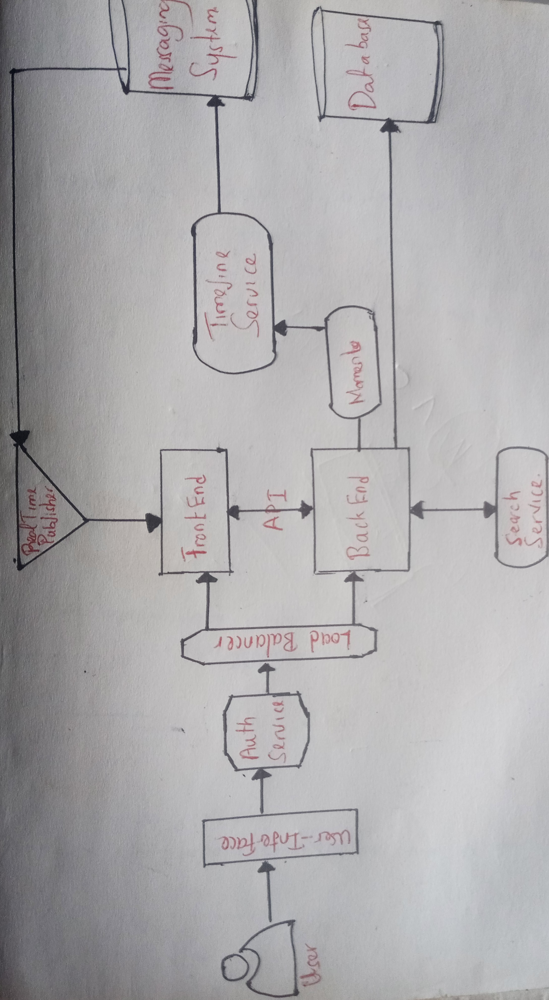
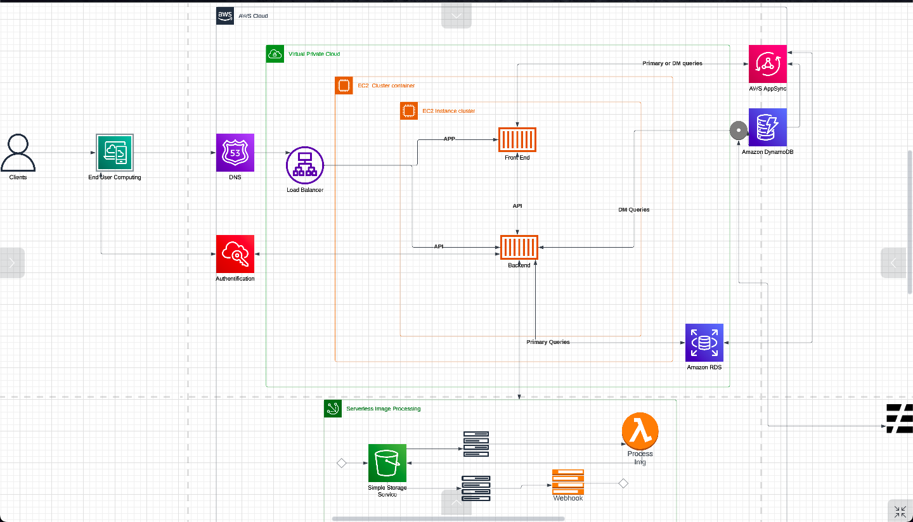

# Week 0 — Billing and Architecture
This week starts off slow with a delay due to the AWS account set up issue but steady work continues as the issue was long resolved
I had to follow some steps from the AWS documentation to troubleshoot the issue

## Activating IAM user and role access to the Billing and Cost Management console

1.Signed in to the AWS Management Console with my root user credentials.<br>
2.On the navigation bar, chose your account name, and then chose Account.<br>
3.Next to IAM User and Role Access to Billing Information,I chose the Edit option.<br>
4.Then selected the Activate IAM Access check box to activate access to the Billing and Cost Management console pages.<br>
5.Choose Update option to now use IAM policies to control which pages a user can access.<br>
6.After having activated IAM user access, I attached IAM policies to grant or deny access to specific billing features to my created user.<br>
7.Finally i ran the following command to verify the procedure was succesful and reflected on user's account.<br>

```
aws iam get-user-policy --policy-name Billing --user-name <IAM username>

```

## Here is a checklist of cleared tasks

### Recreated Conceptual Diagram on a Napkin. Tried to be as steady as possible with the hand drawing



### Recreated Logical Architectual Diagram in Lucid Charts


[LucidChart Link](https://lucid.app/lucidchart/452e7be0-be3f-475c-854d-8f34c1af9efb/edit?viewport_loc=-71%2C-76%2C2368%2C1250%2C0_0&invitationId=inv_de0897dd-fbdf-4f31-82c4-baf11cd1e715)

## Other tasks completed 

1. Created an Admin User and also reinforced root and user account with MFA configurations.<nl>

2. Used CloudShell and ran the following command to display root credentials and other information on the cloudshell.<br>
 
  ```
  aws sts get-caller-identity
  ```
3. Generated AWS Credentials for a new user.<nl>

4. Installed AWS CLI	on Gitpod along with the Gitpod- Github extension making it easy to work on our project.<nl>

5. Created a Billing Alarm for the user account after enabling permissions for billing dashboard access to the user.<br>
  
#### *Though this is where the bulk of the time was spent as i was having a hard time with having to sort out affected policies that were not relevant to the billing dashboard and the user interaction.<nl>

6. Created a Budget through the CLI commands, two in total and also looked into tags and cost explorer and other features on the billing dashboard.<nl>
  [Budget Alarm]()
  
  The following is a sample CLI command used in creating the budget after generating the required json file and saving in our directory.<br>
  ```
aws budgets create-budget --account-id <account ID> --budget '{"BudgetName": "<budget name>", "BudgetLimit": {"Amount": <budget amount>, "Unit": "USD"},  "UseBlended": true, "IncludeUnblended": true}, "TimeUnit": "MONTHLY", "TimePeriod": {"Start": "<start date>", "End": "<end date>"}}' --notification '{"NotificationType": "ACTUAL", "Threshold": 80, "ThresholdType": "PERCENTAGE"}'

  ```
  
7. Tested creating an Amazon SNS topic and added a notification endpoint mine being email on the CLI with the delegated user account and requires confirmation once generated. Started it with this command after generating the topic-arn prior.<br>
  ```
  aws sns create-topic --name billing-alarm
  ```
  
  

#Homework Challenges
  
Most of the challenges faced were later tackled easily thanks to the guidance of Andrew and other lecturers, Looking ahead i hope to follow this methodology meticulously so as to not get lost and behind when encountering issues in the bootcamp.
