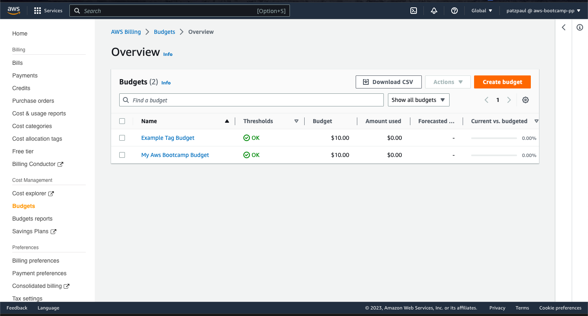

# Week 0 — Billing and Architecture
This week starts off slow with a delay due to the AWS account set up issue but steady work continues as the issue was long resolved
I had to follow some steps from the AWS documentation to troubleshoot the issue

## Activating IAM user and role access to the Billing and Cost Management console

1.Signed in to the AWS Management Console with my root user credentials.<nl>
2.On the navigation bar, chose your account name, and then chose Account.<nl>
3.Next to IAM User and Role Access to Billing Information,I chose the Edit option.<nl>
4.Then selected the Activate IAM Access check box to activate access to the Billing and Cost Management console pages.<nl>
5.Choose Update option to now use IAM policies to control which pages a user can access.<nl>
6.After having activated IAM user access, I attached IAM policies to grant or deny access to specific billing features to my created user.<nl>
7.Finally i ran the following command to verify the procedure was succesful and reflected on user's account.<nl>

```
aws iam get-user-policy --policy-name Billing --user-name <IAM username>

```

## Here is a checklist of Required tasks

### Recreated Conceptual Diagram on a Napkin. Tried to be as steady as possible with the hand drawing


### Recreated Logical Architectual Diagram in Lucid Charts


[LucidChart Share Link](https://lucid.app/lucidchart/452e7be0-be3f-475c-854d-8f34c1af9efb/edit?viewport_loc=-71%2C-76%2C2368%2C1250%2C0_0&invitationId=inv_de0897dd-fbdf-4f31-82c4-baf11cd1e715)

## Other tasks completed 

1. Created an Admin User and also reinforced root and user account with MFA configurations.<nl>

2. Used CloudShell and ran the following command to display root credentials and other information on the cloudshell.<br>
 
  ```
  aws sts get-caller-identity
  ```
3. Generated AWS Credentials for a new user.<nl>

4. Installed AWS CLI	on Gitpod along with the Gitpod- Github extension making it easy to work on our project.<nl>

5. Created a Billing Alarm for the user account after enabling permissions for billing dashboard access to the user.<br>
  
#### *Though this is where the bulk of the time was spent as i was having a hard time with having to sort out affected policies that were not relevant to the billing dashboard and the user interaction.<nl>

6. Created a Budget through the CLI commands, two in total and also looked into tags and cost explorer and other features on the billing dashboard. As you will witness i have two budgets prepared.<nl>
  
  
  The following is a sample CLI command used in creating the budget.<br>
  ```
aws budgets create-budget --account-id <account ID> --budget '{"BudgetName": "<budget name>", "BudgetLimit": {"Amount": <budget amount>, "Unit": "USD"},  "UseBlended": true, "IncludeUnblended": true}, "TimeUnit": "MONTHLY", "TimePeriod": {"Start": "<start date>", "End": "<end date>"}}' --notification '{"NotificationType": "ACTUAL", "Threshold": 80, "ThresholdType": "PERCENTAGE"}'

  ```
 The required json file to be saved and used in our directory.
 ```
 {
    "BudgetLimit": {
        "Amount": "10.00",
        "Unit": "USD"
    },
    "BudgetName": "Example Tag Budget",
    "BudgetType": "COST",
    "CostFilters": {
        "TagKeyValue": [
            "user:Key$value1",
            "user:Key$value2"
        ]
    },
    "CostTypes": {
        "IncludeCredit": true,
        "IncludeDiscount": true,
        "IncludeOtherSubscription": true,
        "IncludeRecurring": true,
        "IncludeRefund": true,
        "IncludeSubscription": true,
        "IncludeSupport": true,
        "IncludeTax": true,
        "IncludeUpfront": true,
        "UseBlended": false
    },
    "TimePeriod": {
        "Start": 1477958399,
        "End": 3706473600
    },
    "TimeUnit": "MONTHLY"
}
 ```
  
7. Tested creating an Amazon SNS topic and added a notification endpoint mine being email on the CLI with the delegated user account and requires confirmation once generated. Started it with this command after generating the topic-arn prior.<br>
  ```
  aws sns create-topic --name billing-alarm
  ```
  
  

# Homework Challenges
  
## Managed to generate two different budgets one with the console and one with the CLI configured with Gitpod but both have a limit of 10$ as i am not ready to incur any charges over 10$.
 
 ## On the logical diagram i added some forums interconnected between the storage bucket and webhooks all encompassed as a serverless image processing storage that relays to the backend with APIs. 
